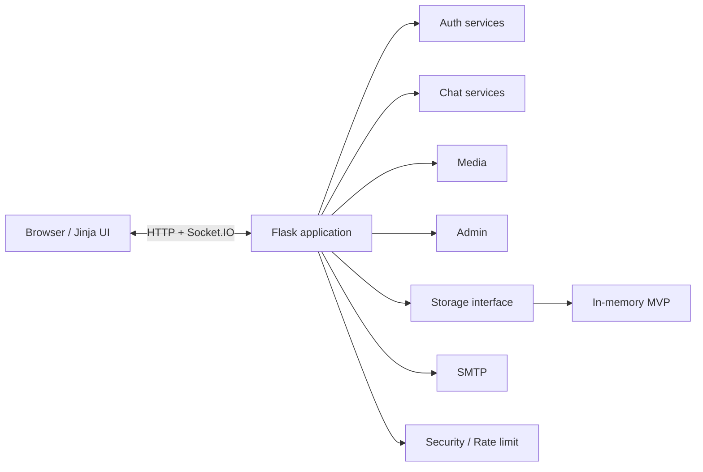

# Architecture

## Layers

1. **Presentation** – Jinja templates + design-system CSS/JS
2. **HTTP / WebSocket** – Flask routes + Flask-SocketIO events
3. **Domain services** – `cipherchat.auth`, `cipherchat.chat`, `cipherchat.admin`
4. **Infrastructure** – `cipherchat.services.storage`, email, security, rate_limit
5. **Config** – `cipherchat.config.Config` (env-driven)

## Modernization path (preserve behavior)

1. Keep route contracts stable.
2. Move pure functions into services (done for hashing, email, rate limit, storage).
3. Extract blueprints once covered by tests.
4. Swap `store` implementation for PostgreSQL + Redis without changing call sites.
5. Introduce a versioned REST/WebSocket API before any optional SPA client.
